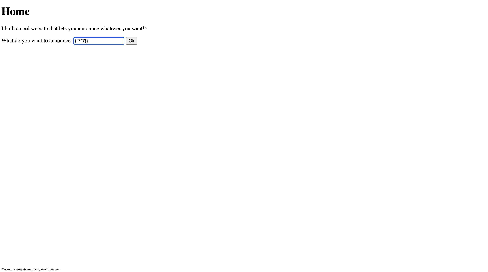

# Server Side Template Injection 1

Basically, a template injection is whenever there is no input sanitization in template based languages such as jinja2 and then the user can simply test native syntax until the correct language is found. For example, in jinja2, the syntax for printing a variable is `{{ variable }}`. If the user can input this into a web application and it is rendered, then the user has found a template injection vulnerability.

In this challenge, we are given a web application that has a form that takes in a name and then greets the user with that name. We can test for template injection by inputting `{{7*7}}` into the name field and seeing if it renders `49` on the page. After this, we can use the input "{{request.application.__globals__.__builtins__.__import__('os').popen(cat flag).read()}}. This will read the flag file and display it on the page.

